#  &nbsp; GitHub Actions &nbsp; 

## Workflows
- [Auto merge Dependabot Pull Request](.github/workflows/dependabot-auto-merge.yaml)

## Actions

  <a href="https://github.com/qoomon/actions--access-token">
  <picture>
    <source media="(prefers-color-scheme: dark)" srcset="stats-cards/actions--access-token-dark.svg">
    </picture></a> &nbsp;

  <a href="https://github.com/qoomon/actions--parallel-steps">
  <picture>
    <source media="(prefers-color-scheme: dark)" srcset="stats-cards/actions--parallel-steps-dark.svg">
    </picture></a> &nbsp;

  <a href="https://github.com/qoomon/actions--context">
  <picture>
    <source media="(prefers-color-scheme: dark)" srcset="stats-cards/actions--context-dark.svg">
    </picture></a> &nbsp;

  <a href="https://github.com/qoomon/actions--set-env">
  <picture>
    <source media="(prefers-color-scheme: dark)" srcset="stats-cards/actions--set-env-dark.svg">
    </picture></a> &nbsp;

  <a href="https://github.com/qoomon/actions--create-deployment">
  <picture>
    <source media="(prefers-color-scheme: dark)" srcset="stats-cards/actions--create-deployment-dark.svg">
    </picture></a> &nbsp;

  <a href="https://github.com/qoomon/actions--event-inputs">
  <picture>
    <source media="(prefers-color-scheme: dark)" srcset="stats-cards/actions--event-inputs-dark.svg">
    </picture></a> &nbsp;

  <a href="https://github.com/qoomon/actions--setup-git">
  <picture>
    <source media="(prefers-color-scheme: dark)" srcset="stats-cards/actions--setup-git-dark.svg">
    </picture></a> &nbsp;

  <a href="https://github.com/qoomon/actions--oidc-debug">
  <picture>
    <source media="(prefers-color-scheme: dark)" srcset="stats-cards/actions--oidc-debug-dark.svg">
    </picture></a> &nbsp;

  <a href="https://github.com/qoomon/actions--create-commit">
  <picture>
    <source media="(prefers-color-scheme: dark)" srcset="stats-cards/actions--create-commit-dark.svg">
    </picture></a> &nbsp;

  <a href="https://github.com/qoomon/actions--create-tag">
  <picture>
    <source media="(prefers-color-scheme: dark)" srcset="stats-cards/actions--create-tag-dark.svg">
    </picture></a> &nbsp; 
 

---

- [GitHub TypeScript Action Template](https://github.com/qoomon/actions--template)

